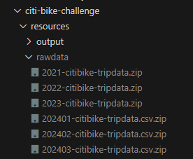
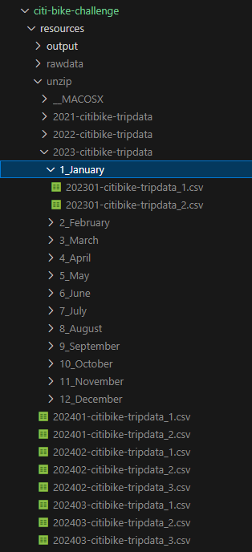
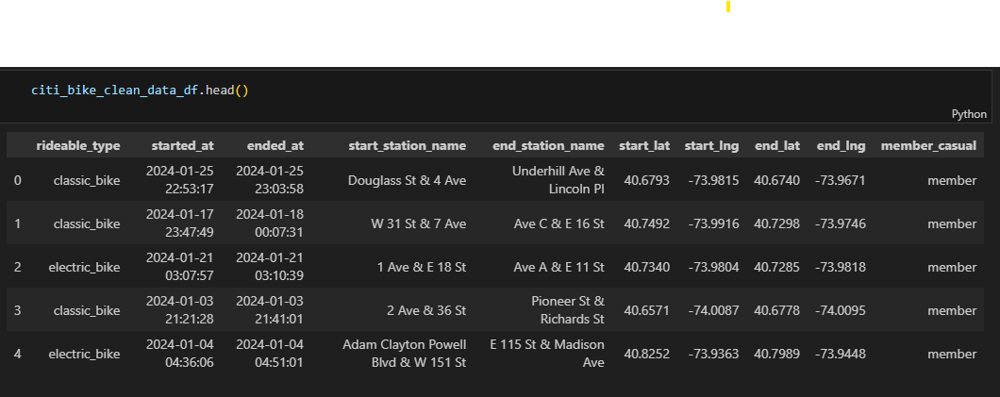
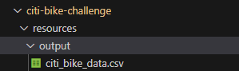
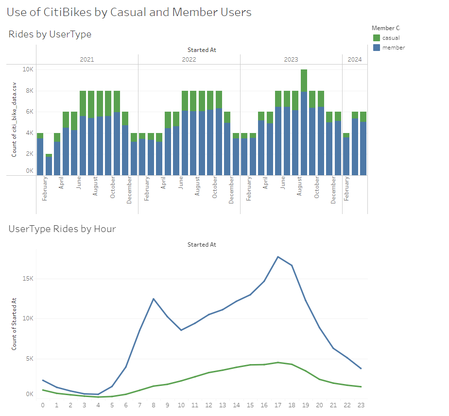
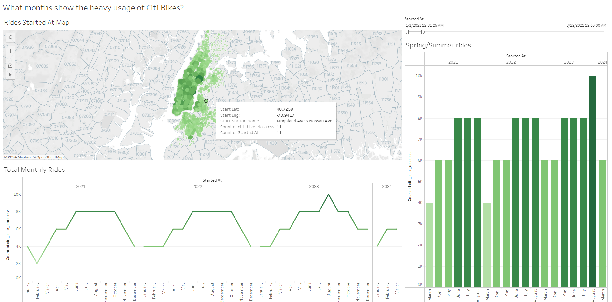

# citi-bike-challenge

This project is created for the University of Minnesota - Data Visualization and Analytics Bootcamp - Challenge #18.

### Contributor : Indu Bandi

# Project Overview

Dataset for New York Citi Bike Visualizations project was obtained from https://citibikenyc.com/system-data. I downloaded the files for timeframe starting from January 2021 - March 2024 and created a visualization using Tableau public. Visualizations for this project can be found here:

https://public.tableau.com/app/profile/indu.bandi/viz/NYC_CitiBike_Visualizations_17145372596060/NewYorkCitiBikiVisualizations?publish=yes

Downloaded zip files were saved into resources/rawdata folder but not checked into git due to file size. Downloaded files are as shown:

### Data Cleanup

1. Using the zipfile library, for each zip file in the rawdata folder, extracted the contents of the zip files and saved under resources/unzip folder. These files are not uploaded to git as well due to size restrictions. Unzip files are as shown:

2. Since each of the unzipped csv files has huge amount of data, I decided to choose random samples of 2,000 records from each csv for the visualizations.

3. For Data on January 2021, the format and fields are slightly different compared to later months. Hence renamed some of the columns to align with the latest data, removed unwanted columns and exported the dataframe to a csv under [output](resources/output) folder

### Visualizations

Used Tableau Public to import the csv file created from Data cleaning step and create visualizations.

#### Dashboard 1 - Use of CitiBikes by User Type

With the random sample of 2000 chosen from each month, created a dashboard to show the use of bikes by members and non-members by month and also by the usage by hour.

Observation from this dashboard is that the member rides are usually during the peak hours like morning and evening where as casual members tend to use bikes more in the late afternoon and evening.

### Dashboard 2 - What months show the heavy usage of Bikes?

With the random sample of 2000 chosen from each month, created a dashboard to view the usage of citi bikes by each month amd also the dashboard shows the map for the start station names and count.

Observation from this dashboard is that the usage of bikes is pretty high and consistent during spring and summer months. July 2023 recorded the high usage of bikes from the dataset.

## References

1. https://stackoverflow.com/questions/20906474/import-multiple-csv-files-into-pandas-and-concatenate-into-one-dataframe

2. https://dev.to/abbazs/how-to-unzip-multiple-zip-files-in-a-folder-using-python-6dd

3. https://perials.com/getting-csv-files-directory-subdirectories-using-python/

4. https://pandas.pydata.org/pandas-docs/stable/reference/api/pandas.Index.isin.html

